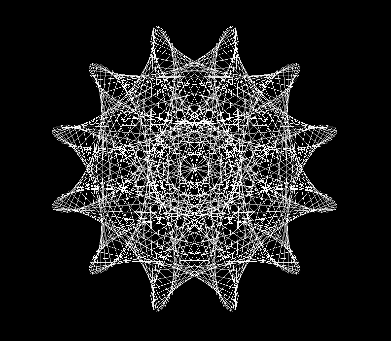
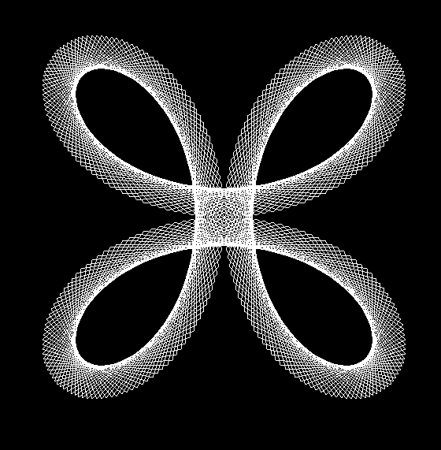

# Maurer Rose
A [Maurer Rose](https://en.wikipedia.org/wiki/Maurer_rose) simulation built with raylib and C++.
In geometry, A Maurer rose is formed by connecting points on a rose curve using straight line segments. It was introduced by Peter M. Maurer in his article titled `A Rose is a Rose....`. The rose curve is defined by `r = sin(nθ)`, where `θ = k·d`, `k = 0..360`, and `n`, `d` are positive integers.

### build

```bash
make main
```
### usage

```bash
./maurer [n] [d] [background] [rose]
```
all arguments are optional and positional
|argument|explanation|
|--------|-----------|
|n|positive number(default: `6`)|
|d|positive number(default: `71`)|
|background|background color as hexadecimal(default: `#000000`)|
|rose|rose color as hexadecimal(default: `#ffffff`)|

### controls

|control|action|
|-------|------|
|O|toggles outline of the rose|
|mouse wheel|zoom in/out|

### examples


n = 6, d = 71


n = 2, d = 29